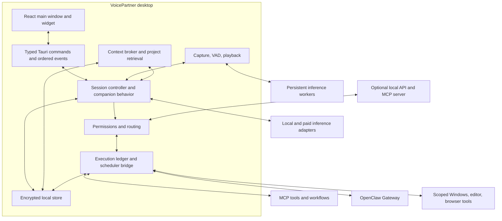
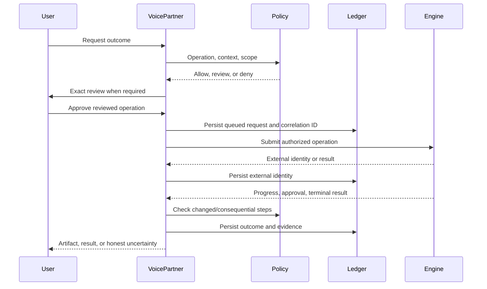

# VoicePartner — system architecture

Design date: 2026-09-27. This describes observed code and the proposed target separately. See [project structure](docs/project-structure.md) for planned files and [contracts](docs/data-and-contracts.md) for interfaces.

## 1. Current implementation

Baseline inspected: `be13b48` on main. Original local planning edits are preserved in [the archive](docs/archive/README.md).

| Subsystem | Observed implementation | Required change |
|---|---|---|
| Desktop | Tauri main window, tray, separate widget | Backend ownership of conversation state and global shortcut handling |
| Capture | CPAL, growing sample vector, WAV output, fixed 200 ms wait | Bounded buffers, supported sample formats, explicit completion, VAD |
| Recognition | New whisper.cpp CLI process per recording; English hardcoded | Warm worker and partial transcripts |
| Reasoning | Ollama chat stream | Frame/UTF-8-safe decoding, provider abstraction, cancellation |
| Speech | Per-request Piper/SAPI/Kokoro; PowerShell WAV playback | Phrase streaming, persistent inference, native playback |
| Stop | `stop_speaking` returns success without stopping audio | Owned cancellation across generation and playback |
| Context | Window title and manual note | Backend grants; stop-sharing must also stop the automatic path |
| Memory/RAG | BLOB embeddings, cosine scan of last 200 records | Project isolation, provenance, source identity, indexed retrieval |
| Sessions | Four-hour reuse helper | New-session command must actually close/create a session |
| Storage | Bundled SQLite; keyring dependency | Encryption and real credential-store use are not implemented |
| Integration | Tauri commands/frontend wrappers | MCP, external-job lifecycle, provider and API services |

Frontend production build passed. Native `cargo test --locked --offline` subsequently completed successfully with **zero tests**; this proves compilation, not runtime quality. No tracked automated suite or CI was found. Live speech, integrations, installer, and pilot qualification remain open.

Also address TTS error cleanup, temporary files, model download integrity, and the currently disabled Content Security Policy before expanding privileged automation.

## 2. Target topology

Keep one modular desktop product. Native inference and local MCP servers are supervised workers. OpenClaw/n8n and remote providers remain separately owned services. No cloud microservices are required for the core.

| Component | Owns | Boundary |
|---|---|---|
| Frontend | Inputs, accessible views, reviews | No credentials or final policy decisions |
| Session controller | Turn IDs, ordered events, generation, spoken offsets | External agents keep their own internal run state |
| Companion behavior | Mode, personality, check-in eligibility | Cannot grant permissions |
| Audio | Device ownership, preprocessing, bounded streams | Cannot choose cloud destinations |
| Providers | Capability discovery, inference, timeout, usage | Cannot authorize tools |
| Context broker | Selection, provenance, token budgets, destination disclosure | No unrequested global screen collection |
| Execution service | Routing, ledger, dispatch, reconciliation | Never claims effects it cannot verify |
| Policy | Grants, previews, approval binding, recursion guards | Treats remote annotations as hints |
| Adapters | Engine-specific protocol translation | Cannot bypass ledger/policy |
| Storage | Transactions, migrations, indexes, retention | Stores secret references only |

## 3. Conversation flow

1. The UI sends an intent. Backend allocates session/turn IDs and admits one foreground turn.
2. Audio capture signals readiness or error; VAD/PTT determines boundaries. Partial transcript is display-only, not action authorization.
3. Context broker selects bounded history, permitted memories, project sources, and separately granted screen context.
4. Provider generates conversational content or a structured action proposal. Companionship never requires an automation engine.
5. Phrase segmenter queues speakable clauses while generation continues. Code/URLs/long tables are displayed instead of read in full.
6. Policy routes proposals through the execution service. Only verified results are narrated as completed actions.
7. Persist final/interrupted turn and spoken progress. Background memory/indexing work yields to foreground conversation.

Both WebViews subscribe to the same authoritative backend state. Reconnecting views request a snapshot and ordered events, not a new session. Stable IDs allow deduplication and stale-event rejection.

## 4. Execution flow

One executor owns each operation. Do not retry a timed-out write through another engine without proof that the first attempt had no effect. Parallelism is limited to independent operations within resource and permission limits.

Gateway authentication does not guarantee downstream restrictions. Opaque delegated jobs must be narrowed or restricted when their internal actions cannot be controlled. See [integrations](docs/integrations.md).

## 5. Concurrency and resource ownership

- One microphone stream, foreground conversational generation, and audible speech stream. Voice previews share playback arbitration.
- Each turn owns cancellation for recognition, generation, synthesis queue, and playback. Tool jobs have separate cancellation scopes; global stop requests both.
- Audio callbacks never perform DB, network, model-loading, or blocking filesystem work.
- Bounded channels connect pipeline stages. Overflow produces a visible degraded-state error, not unbounded buffering.
- CPU-heavy work stays off the async executor; DB locks are not held across await points.
- Workers expose readiness, health, restart, and shutdown. After dispatch, distinguish safe replay from unknown outcomes.
- Speech/foreground work takes resource priority over embedding, indexing, summarization, and local external agents. Idle workers may unload with a visible warming state.
- Default concurrency: one desktop-mutating run, two independent read-only external runs, one background indexing job. Adapters can lower limits.

## 6. Trust and locality

Track connection location, inference location, and downstream destinations separately. Private mode admits only verified local routes with egress restrictions; merely using loopback is insufficient.

Tauri IPC is the desktop interface. The optional local API binds loopback, authenticates each client, enforces scoped grants, and validates origin/host where relevant. It defaults off. LAN/mobile access is later work.

Guided setup is the only path to install executable integration servers. Never execute package names emitted by a model. Documents, screenshots, tool descriptions and tool results are untrusted data, not sources of authority.

## 7. Persistence and recovery

Store settings, profiles, sessions/turns, approved memories, projects, document identity/chunks, index metadata, connections, grants, runs/events, routines/schedules, and usage. Secrets remain in the OS credential store.

Back up the v6 database before migration. Separate schema upgrade, encryption conversion, and embedding rebuild. Label unknown historical provenance. Reconcile interrupted external jobs; do not replay mutations on restart.

Adapter failure must not block startup or local conversation. Display adapter health independently from model/audio readiness. Keep compatibility wrappers around old Tauri commands until both frontends migrate.
