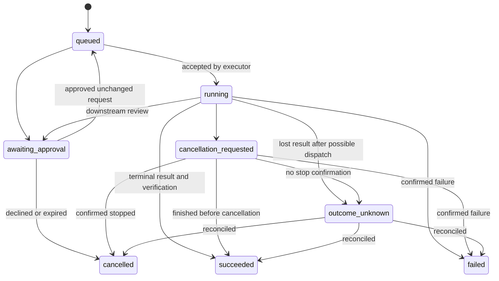

# Data model and public contracts

Status: proposed v1 contracts, to implement in S0–S5. Existing commands and tables remain supported during migration. Public schemas live in the planned `contracts/schema/` directory; generate TypeScript representations and validate Rust serialization against the same fixtures in CI.

## 1. Shared conventions

- UUID strings identify local entities. Provider/external IDs are opaque strings and never parsed for meaning.
- UTC Unix milliseconds for stored timestamps; local timezone is explicit for schedules.
- Public payload keys use snake_case, matching Rust serde output; adapters translate upstream casing.
- Every command response is a value or structured error `{code, message, retryable, correlation_id}`. Error text is redacted and never contains auth headers, keys, or unbounded upstream response bodies.
- Event envelope: `{schema_version: 1, event_id, sequence, occurred_at, session_id?, turn_id?, run_id?, kind, payload}`. Sequence is monotonic within its session or run stream.
- Receivers deduplicate by ID/sequence. Snapshots include the last sequence so reconnecting clients can discard stale events.
- Proposed JSON schemas are strict for security-relevant request fields. Unknown optional response fields can be ignored by compatible consumers. Major contract changes require a version bump and fixture coverage.
- Distinguish absent, unknown, unsupported, and false. Missing usage is not zero cost; missing cancellation support is not successful cancellation.

## 2. Conversation contracts

| Type | Required content | Behavior |
|---|---|---|
| Session | ID, project ID or personal scope, partner profile, mode, timestamps | Scope changes create a fresh scoped session; don't merge client contexts |
| Turn | ID, session ID, input kind, input/final content, state, provider reference | Partial, completed, interrupted, failed are explicit |
| ProviderCapabilities | Provider/model, text/audio/vision/tools/streaming/cancel support, tested revision | Only advertise features actually qualified |
| VoiceProfile | Provider, voice ID, language, pace, supported style settings, pronunciation dictionary reference | Unsupported controls are disabled in UI |
| ContextGrant | Source, project, destination, permitted fields, lifetime, revocation time | Checked at collection, retrieval, and outbound dispatch |
| TurnMetrics | Monotonic timestamps for capture, endpointing, STT, retrieval, generation, synthesis, playback | Content-free measurement; no misleading sum of overlapping stages |

Backend conversation states: idle, listening, transcribing, generating, speaking, cancelling, failed. Generation and playback may overlap; the snapshot represents their separate substate rather than mutually exclusive UI booleans.

Canonical events include `session.snapshot`, `turn.started`, `transcript.partial`, `transcript.final`, `response.delta`, `speech.started`, `speech.progress`, `turn.completed`, `turn.interrupted`, and `turn.failed`. A turn has one terminal result. Outdated worker output cannot append to a newer turn.

Interruption retains generated text for history with an interrupted marker and spoken offset. Conversational context marks which text the user actually heard. Never assume unplayed instructions were communicated.

## 3. Integration and execution contracts

| Type | Fields |
|---|---|
| IntegrationConnection | `id`, `adapter_id`, `display_name`, `endpoint` or local process spec, `credential_ref`, `enabled`, connection locality, downstream data policy, health, supported/tested version |
| Capability | Namespaced ID, connection ID, kind `tool/workflow/agent`, input/output schemas, schema revision/hash, effect classification, supported lifecycle operations, destinations |
| ExecutionRequest | Request ID, capability ID, project/session scope, structured arguments or objective, explicit context references, grant ID, deadline, budget limit, ancestry |
| ExecutionRun | Local/external IDs, request ID, executor identity, scope, immutable approved request hash, state, sequence, timestamps, verification state, artifact references, usage |
| ApprovalRequest | ID, run ID, operation hash, exact target/action, change preview, data destination, expiry, downstream approval reference, decision |
| ExecutionResult | Outcome, bounded textual summary, artifacts, verification evidence, external references, limitations, usage provenance |
| ScheduleBinding | Local ID, owner `voicepartner/external`, workflow revision, timezone, schedule definition, external schedule ID, grant, state |

Tool annotations from MCP are hints. Local policy assigns final effect classification. Unclassified capabilities default to review-required and cannot receive standing mutation grants.

### Run lifecycle

An RPC timeout is not a terminal remote failure. Do not map it to success, cancellation, or permission to retry. A provider can report completion while verification is still pending; preserve raw reported state separately from the normalized user-facing outcome.

Persist queued request and stable dispatch correlation before network submission. Persist returned external ID before showing acceptance. Engines without idempotent submission or lookup keep uncertain submissions in `outcome_unknown`; never invent exactly-once execution.

Approvals bind the connection, capability revision, project, normalized arguments, target, and approved context destinations. Any change invalidates approval. Default interactive review expires after ten minutes; recheck at dispatch. One-use grants are consumed transactionally. Saved workflow grants bind to workflow revision and parameter scope.

### Adapter interface

| Operation | Requirement |
|---|---|
| `inspect_connection` | Version, health, locality facts, supported operations; no write actions |
| `discover_capabilities` | Bounded pages; namespaced IDs and schema revisions |
| `validate_request` | Input and scope validation without executing |
| `submit` | Return accepted external identity, terminal result, or ambiguous dispatch |
| `observe` | Progress/events or polling through the same normalized contract |
| `cancel` | `confirmed`, `requested`, `unsupported`, or `unknown` |
| `reconcile` | Inspect known run/correlation after restart or loss |
| `respond_to_approval` | Only for adapters with verified downstream approval binding |
| `disconnect` | Revoke local admission and close owned resources; report surviving jobs |

There is no default implementation that claims success for unsupported operations. Local model adapters and automation adapters are different interfaces.

## 4. Frontend, local API and MCP exposure

Keep current Tauri commands behind wrappers while migrating. New command groups:

- Conversation: session snapshot/create/close, submit text, start/stop capture, cancel turn, set mode.
- Providers: inspect/list/configure, store/delete credential, choose profile, query usage.
- Integrations: list/configure/test/discover/enable/disable; tests are read-only.
- Executions: validate/submit/list/get/cancel, review/approve/deny.
- Projects: create/select, grant sources, ingest/search/remove documents.
- Memory: list/edit/pin/correct/forget, toggle retention.
- Routines: save reviewed workflow, create/update/disable schedule.

Local API v1, disabled by default, reuses these services:

| Route | Result |
|---|---|
| `GET /v1/health` | Minimal authenticated health/version; no user content |
| `POST /v1/sessions` | Create a session within client grant |
| `POST /v1/sessions/{id}/turns` | Admit a text turn |
| `POST /v1/executions` | Submit an explicitly scoped operation |
| `GET /v1/executions/{id}` | Scoped run snapshot |
| `POST /v1/executions/{id}/cancel` | Cancellation request and truthful status |
| `GET /v1/events` | Authenticated scoped event stream |

A client cannot approve its own elevated request. Native user review is the approval authority unless a pre-existing grant covers the operation. Rate-limit local API clients and return bounded payloads.

The optional MCP server projects `task_submit`, `task_status`, `task_cancel`, `project_context_search`, and `notification_request` with per-client scopes. Personal memory is not exposed by default. Notification requests respect quiet hours and are rate-limited. Incoming requests cannot recursively select the same VoicePartner endpoint as executor; ancestry checks and a default maximum delegation depth of three apply.

## 5. Persistent schema

Retain existing `settings`, `sessions`, `turns`, `memories`, and `schema_version` through migration. Proposed additions:

| Tables | Stored purpose | Key constraints |
|---|---|---|
| `projects`, `project_sources` | Client workspace and allowed roots | Stable IDs, canonical paths, no implicit global access |
| `partner_profiles`, `voice_profiles` | Identity and voice preferences | One selected profile per session |
| `documents`, `document_chunks` | Stable source, content hash, revision, page/section positions, ingestion state | Source identity is not filename; active revision selected atomically |
| `memory_provenance`, `embedding_indexes` | Origin, project, fact status, model/version/dimensions | Incompatible embeddings are excluded and queued for rebuild |
| `integration_connections`, `capability_snapshots` | Metadata, credential references, tested protocol/schema | No plaintext secrets |
| `permission_grants`, `approval_requests` | Bound scopes and decisions | Expiry/revocation checked transactionally |
| `execution_runs`, `execution_events`, `artifacts` | Durable lifecycle and evidence | Request-ID uniqueness, monotonic run sequences |
| `routines`, `schedule_bindings` | Reviewed reusable work and owner mapping | One active owner per schedule binding |
| `usage_records` | Provider/tool usage and estimated/reported cost | Unknown is nullable, never zero by default |
| FTS5 and vector tables | Lexical and vector retrieval | Project/model filtering before ranking and context construction |

Store money as integer micro-units plus currency and provenance, not floating-point totals. Cost limits cover only observable/enforceable costs; external-service caps are shown separately.

Sensitive retained text and indexes reside in the encrypted DB. Artifacts stay in approved project/output locations and have a disclosed retention policy. Index deletion, summary deletion, and conversation deletion are related but explicit operations; see [privacy](security-and-privacy.md).

## 6. Migration sequence

1. Inventory data, model paths, and schema v6; create a verified backup and restore point.
2. Append transactional migration v7 for project IDs, partner settings, turn lifecycle metadata, and provenance defaults. Assign old content to a clearly labeled personal/default workspace; never infer client identity.
3. Add v8 connection, grants, approvals, runs/events, and usage tables for integration work.
4. Add v9 document identity, versioned chunks, FTS5 and the qualified vector schema. Rebuild derived indexes in a resumable background job.
5. Convert SQLite to SQLCipher using a new DB file, key in Windows credential store, row-count/integrity checks, and atomic switch. Test SQLCipher + FTS5 + vector extension compatibility in S0 before committing dependencies.
6. Keep legacy embeddings with unknown model provenance out of semantic comparisons; rebuild from retained source text. Lexical retrieval provides a disclosed interim path.
7. On failure, leave the original usable and report recovery. Do not leave half-applied schema, silently drop data, or claim encryption before verification.

Schema version numbers after v6 are reserved by this plan; implement them sequentially and never modify an applied migration. Encryption conversion has its own journal and is not just a schema-version increment. Existing plaintext backups require explicit retention choice and are never called encrypted.

## 7. Worker protocol

Workers exchange a versioned readiness/capability handshake, request IDs, audio format, bounded input, progress/results, cancel, and shutdown. Use framed messages and bounded PCM payloads over a private process transport. Logs use stderr; protocol output is separate. Do not assume standard whisper CLI accepts a persistent streaming protocol: package a tested wrapper/server adapter.

Whisper and Kokoro load models once per worker instance. Parent owns lifecycle and checks exact worker/model hashes. Cancellation stops queued outputs and late results are discarded by turn/request ID. A worker crash generates an error event and cleanup; restart is bounded, with no infinite crash loop.
